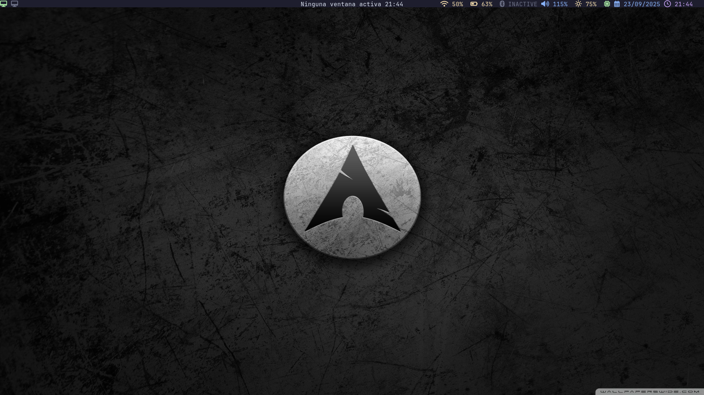
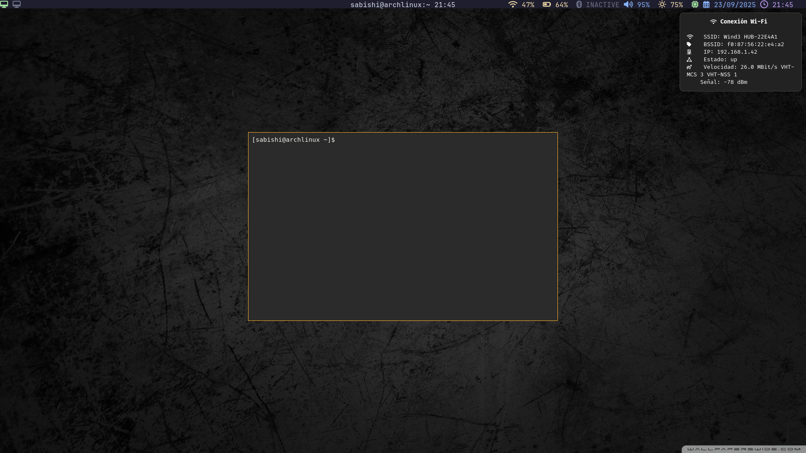
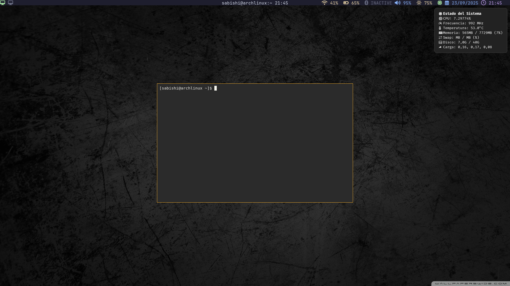
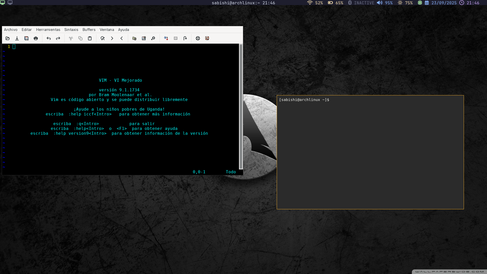
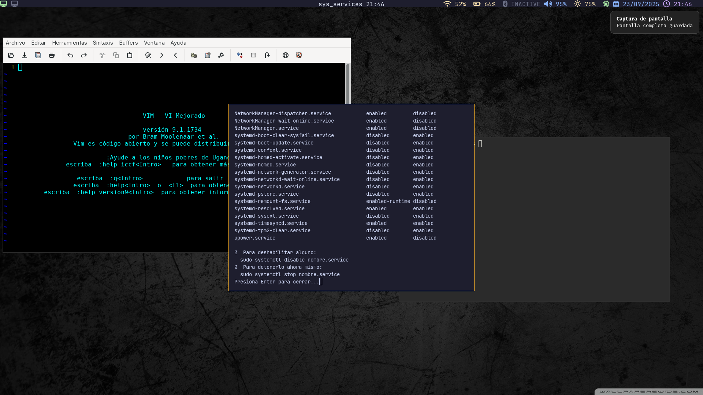
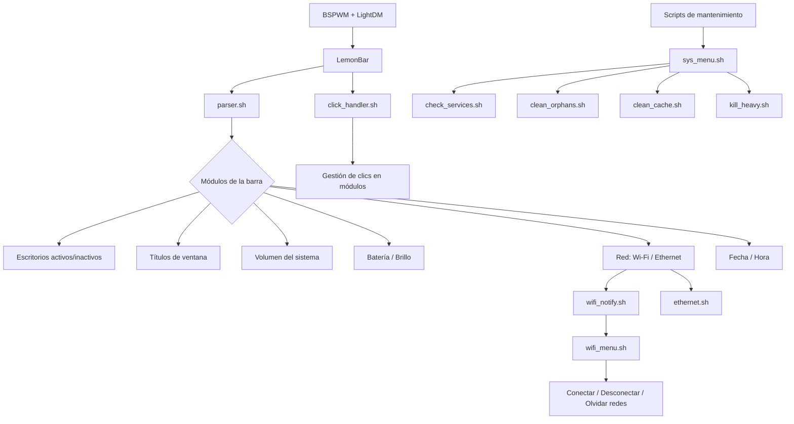

# BSPWM + LemonBar Custom Setup


---


## Descripción general

Este entorno de escritorio ligero y altamente personalizable está basado en **Arch Linux**, usando **BSPWM** como gestor de ventanas y **LemonBar** para la barra de estado.  
Incluye menús interactivos, notificaciones del sistema y scripts de mantenimiento, ofreciendo un flujo de trabajo eficiente y elegante.

---

## Fuentes y dependencias 

- **Dunst:** para notificaciones
- **Feh:** para fondos de pantalla
- **Rofi:** para menús interactivos
- **BSPWM:** gestor de ventanas
- **LightDM:** gestor de inicio de sesión
- **Fuente monoespaciada:** cualquier fuente de tu preferencia

> [!NOTE]
> **Nota:** Para que los iconos en LemonBar se muestren correctamente (, , , etc.), se recomienda usar una fuente monoespaciada que soporte **Nerd Fonts**.  
> Esto no es obligatorio; puedes usar cualquier fuente monoespaciada disponible, pero revisa que los iconos se vean correctamente.


---


## Uso básico de los iconos en LemonBar

**Wi-Fi ()**

- Click izquierdo: muestra el estado de la red vía notificación (SSID, BSSID, IP, dispositivo y estado).
- Click derecho: abre el menú Rofi para buscar nuevas redes, conectarse o desconectar redes guardadas.


**Ethernet ()**

- Click izquierdo: muestra el estado de la conexión Ethernet (IP, velocidad, dispositivo y estado).


**Sistema ()**

- Click izquierdo: muestra información del sistema (CPU: frecuencia, temperatura, carga; memoria RAM y swap; uso de disco).
- Click derecho (doble click): abre el menú Rofi para ejecutar scripts de mantenimiento (`sys_maintenance/`).


>> **Nota:** Todos los menús de Rofi se activan con clic derecho y requieren interacción directa para seleccionar opciones.


---


## Estructura de archivos y scripts


```text
~/.config/
├─ bspwm/                        # Configuración principal de BSPWM
│  └─ bspwmrc                    # Inicialización de BSPWM
├─ bspwm_lemonbar/               # Barra y scripts
│  ├─ bar.sh                      # Lanza LemonBar y parser.sh
│  ├─ config                      # Variables, colores e iconos
│  ├─ parser.sh                   # Procesa módulos del sistema para LemonBar
│  └─ scripts/
│     ├─ click_handler.sh         # Gestiona clics en los módulos
│     ├─ ethernet.sh              # Monitoreo y notificaciones de Ethernet
│     ├─ wifi_notify.sh           # Notificaciones de Wi-Fi
│     ├─ wifi_menu.sh             # Menú Rofi para gestión de Wi-Fi
│     ├─ system_notify.sh         # Notificaciones del sistema
│     └─ sys_maintenance/         # Scripts de mantenimiento
│        ├─ check_services.sh     # Revisión de servicios habilitados
│        ├─ clean_orphans.sh      # Elimina dependencias huérfanas
│        ├─ clean_cache.sh        # Limpia cache de paquetes
│        ├─ kill_heavy.sh         # Mata procesos que consumen demasiada memoria
│        └─ sys_menu.sh           # Menú Rofi para mantenimiento
├─ rofi/                          # Temas Rofi
│  ├─ wifi.rasi                   # Tema oscuro para Wi-Fi
│  └─ ethernet.rasi               # Tema Ethernet
├─ feh/
│  └─ themes/                     # Fondos de pantalla
├─ dunst/
│  └─ dunstrc                      # Configuración de notificaciones (obligatorio)
├─ sxhkd/
│  └─ sxhkdrc                      # Atajos de teclado
```


---


## Descripción de scripts y módulos

  **parser.sh**

  Lee información del sistema y BSPWM.

  - **Muestra:**

   - Escritorios activos e inactivos

   - Título de ventana activa

   - Volumen del sistema

   - Estado de batería y brillo

   - Recursos del sistema

   - Red (Wi-Fi/Ethernet) y fecha/hora

   - Formatea la salida con colores e iconos para LemonBar.

---

## Llamado automáticamente por bar.sh.

  **click_handler.sh**

   - Gestiona clics en módulos de la barra.

   - Permite abrir menús Rofi para Wi-Fi, Ethernet o scripts de mantenimiento.

  **wifi_menu.sh**

  Menú Rofi interactivo para redes Wi-Fi.

  - **Funcionalidades:**

   - Conectar redes guardadas o nuevas (pidiendo contraseña vía Rofi)

   - Desconectar la red activa

   - Olvidar redes guardadas

  - **Presenta 3 columnas:**

   - Nombre de red (ancho fijo 30 caracteres)

   - Botón "Olvidar" (si aplica)

   - Botón "Conectar/Desconectar"

 **wifi_notify.sh / ethernet.sh**

   - Envían notificaciones del estado de la red usando Dunst.

   - Integración con parser.sh para mostrar iconos en LemonBar.

   - Al hacer clic izquierdo, muestran detalles de la conexión.

 
 **system_notify.sh**

  Envía notificaciones del sistema, procesos pesados y eventos importantes mediante Dunst.


 **sys_maintenance/**

  - **check_services.sh:** Lista servicios habilitados y permite detenerlos/deshabilitarlos.

  - **clean_orphans.sh:** Elimina dependencias huérfanas de Pacman.

  - **clean_cache.sh:** Limpia la cache de paquetes.

  - **kill_heavy.sh:** Mata procesos que consumen demasiada memoria.

  - **sys_menu.sh:** Menú Rofi para ejecutar los scripts de mantenimiento de forma interactiva.

---

## Configuración de Rofi

  Archivos: ~/.config/rofi/wifi.rasi y ethernet.rasi

  **Propiedades:**

  - **Fuente:** JetBrains Mono 10

  - **Colores:** Fondo oscuro, texto blanco, selección verde

  - **Columnas:** 2-3 según menú (Wi-Fi tiene 3 columnas)

  - **Posición:** Desplazamiento personalizado y esquina de pantalla

---

## Atajos de teclado (sxhkd)

  Archivo: ~/.config/sxhkd/sxhkdrc

  **Permite:**

   - Abrir terminal

   - Lanzar dmenu/Rofi

   - Controlar ventanas BSPWM

   - Recargar configuración de barra o sxhkd

--- 

## Lanzamiento del entorno

   - Iniciar sesión con LightDM

   - BSPWM carga automáticamente desde .xinitrc o bspwmrc

   - bar.sh se ejecuta al inicio y lanza parser.sh con LemonBar

   - Interacción con módulos mediante clics o menús Rofi

---

## Imágenes







## Diagramas de flujo



---

## Créditos

**Autor:** Yandri Loor

**Basado en:** Arch Linux, BSPWM, LemonBar, Rofi, Dunst y Feh

**Inspiración:** Documentación oficial y buenas prácticas de usuarios avanzados de Linux


